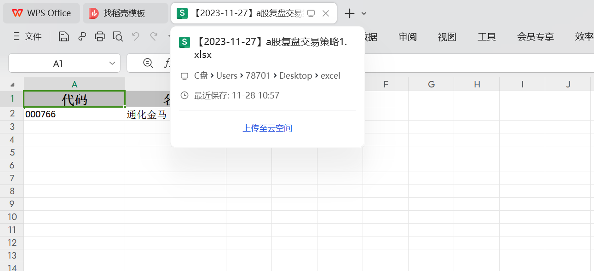
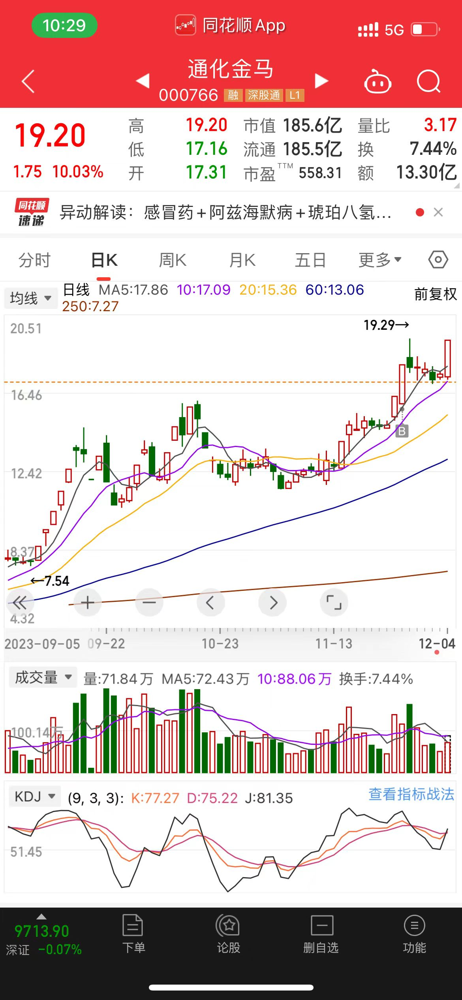
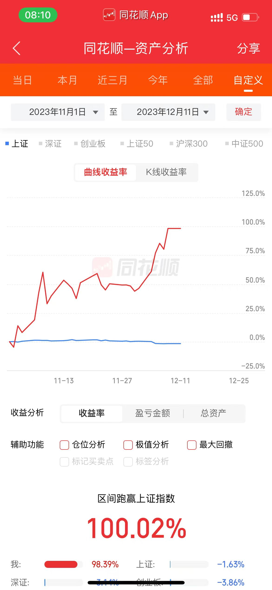

# 文档底部会有自己对市场的思考以及复盘（不定时更新），不作为进场依据，仅供参考

# trading-strategies

相关技术栈：jdk8，springboot，mybatis-plus，hutool，mysql，caffeine，线程池等。项目中所有技术点纯个人搭建，技术不复杂，复杂的是背后的计算逻辑。

当前仅提供了获取某日涨停板，某日强势股，二连板，连板等功能。

其他具体量化策略相关接口以及交易策略目前暂时不提供，如果有兴趣，可以自己实现IQuantitativeStrategiesService，写自己的策略。

由于token是付费获取，所以当前工程中没有提供token，如果想使用该工程，需要使用UrlConstant中没有token的url路径替换BaseServiceImpl里面的url路径。

新增接口文档支持~：http://127.0.0.1:8080/doc.html#/home

如有喜欢做交易志同道合的朋友可以加V：Jiangcy233

我的口号是：编程创造一切，拒绝人工复盘，直接代码导出~

### 其他复盘以及交易策略后续会根据需求慢慢展示，尽情期待~~~

### --致交易者

做交易的人一旦成功了，
一生都不用为钱发愁了。
十年痛苦无人问，
一招悟道世人问。
只有自己知道，
曾经的自己承受过什么，
你所付出的终将拿回来。

### --致码农

编程和金融都是一张王牌，
如果两者结合到一起就是一副王炸。
只要有想法，
没有什么是代码实现不了的。
只要有行动，
一切都将会取得成功。

## 守得云开见月明 ，静待花开终有时

### 回顾
#### 2023/12/11 
之前一直不理解市场的一个时间和空间的概念，昨天朋友来杭州逛了逛西湖，一下子开了窍。行情的空间上涨空间是要通过时间来换取的， 这也是我们常说的时间换空间。
怎么理解呢，行情一旦短时间连续涨停，他的上涨空间是有限的，往往在前期高点位置就进行反转。
而如果我们想要突破这个前期高点，形成趋势，必须要有通过长时间的盘整修复，才能有突破的可能。换句话说，如果行情加速冲到前期高点，90%的概率是反转。
#### 2023/12/11
哪天刷抖音看到了一句话很经典，上涨行情死叉买入，下跌行情金叉卖出。什么意思呢。行情一定是会按照破浪进行的，不管是大级别还是小级别，
在上涨行情中，死叉代表行情回调，下跌行情中，金叉代表行情反弹。当然，不是说出现死叉和金叉就一定这么做。只不过这种思路确实很厉害
#### 2023/12/11
之前跟过一个期货老师学到的一句话受益匪浅：要以止损来开仓。
每个进市场的人都想赚大钱，去追涨停板的股票。但是这种风险是非常大的，你会发现，你开仓的理由千变万化，没有一个统一的开仓理由，
止损的点位也不好确认。我从来不认为追龙头，追板是一种交易策略。这应该是一种情绪交易的直接体现，而在这个市场里赔钱往往是因为情绪交易所导致的。
所以在开仓前一定要问自己，这笔交易进场的理由是什么，止损的点位是多少，是否能忍受住这么多的止损。
#### 2023/12/11
中午睡不着觉，想了一下什么样的人才能在这个市场上存活。我觉得不是那种天天复盘，沉迷在股票里面的人。之前在全职做股票的时候会有一个感觉，就是早上起来，
就迫不及待想要等到9点市场开盘，然后在市场里面厮杀，无论是赚钱还是亏钱，这种激素飙升的感觉会让人感觉非常刺激，而到了3点之后，你会发现你的生活是空虚的，
你不知道该干什么了，你说复盘吧，亏损了那么多没心情，盈利了那么多想着又是明天能接着赚多少钱，整个人会沉迷在股市中。当我发现全职做股票的危害时，
我赶紧重操旧业找了个程序员的班上，之后又培养了跑步的运动爱好，每天早上6点起床，洗漱做饭，7点出门到公司7点半左右，打开电脑跑一边代码，筛选出几只不错的股票，
再把每只股票的买进点，止损点考虑好，就结束了，不到10分钟复盘完毕。开盘的时候会下楼抽根烟，把该买的买，该卖的卖，然后回公司干活，3点收盘之后也不会感觉空虚。
6点下班之后回家休息休息，7点出门跑步一个小时。8点回家洗个澡躺床上刷手机看视频，一天就过去了。所以真的不要把大量的时间用在复盘上，能在这个市场上找到规律的人，
很快就能找到规律，在这个市场上找不到规律的人，复盘多久都赚不了钱。把时间都消耗在股市上，不如努力提升自己。能在股市上大放异彩的人，在其他领域中也会是佼佼者。
#### 2023/12/12
为什么想在这个市场上做中线？因为懒，进场之后我完全可以一段时间不看盘了，这种对我不好控制情绪交易的人来说，是最合适的选择了

#### 2023/12/13 7:43
这两天工作实在是太忙了，没有时间看盘面，不过之前的几只股票还一直在关注，确实位置相对来说比较合理。昨天通化金马跌停了，符合预期，目前我认为可能会跌倒20元附近，
形成支撑，至于之后是突破历史高点还是在这里结束，谁也不知道。昨天有人问我，通化金马都跌停了，为什么还不卖出？一是因为我的进场位置很低，即使再有两三个跌停，
我也不会亏，二是跌停不是我离场的理由，目前看通化金马没有一个趋势反转的信号，当然相对而言涨停也不是作为我进场的理由。
昨天听说之前的一个前女友结婚了，也很正常，我今年都26了，在市场撕杀了也好6年了，本来以为是逆天改命的，结果没想到是一场修行，不知道未来的道路会怎么样。
#### 2023/12/13 9:48
早上还在说通化金马，早盘直接涨停了，说实话，这样有点高位震荡的感觉，我也不知道应该怎么处理，如果过两天跌回昨天跌停板附近，再次启动，会更好一点，
但是现在对我来说不知道该怎么操作了，不管了，看着吧。

### 【2023/12/11-2023/12/15】

整体市场处于弱势。周末复盘后可选操作股票不多，建议减少交易次数。目前满仓通化金马，本周关注历史高位以及突破后的走势。

603535 嘉诚国际—— 11/29日放量涨停后，一直处于横盘，12/08日是一个合适的入场点。止损点在18附近
600509 天富能源—— 同嘉诚国际，6.50附近强支撑，跌破离场
000829 天音控股—— 关注11/07日涨停板的高点。现在位置可以考虑低吸，止损位在10.50附近
002962 五方光电—— 关注二板之后的周一的走势。目前看结构比较不错，有持续的可能。如果周一能高开低走到17.40-17.90附近形成支撑，可以进场。最好在17.40
601138 工业富联—— 大级别C点，持续关注。等待结构
600895 张江高科—— 大级别C点，持续关注，等待结构。如果跌破20趋势结束，如果在当前位置横盘，C点有效。
002436 兴森科技—— 结构十分完美，14.70附近作为止损点。目前没有更好的入场位置。持续关注
002456 欧菲光—— 等待下跌到9块附近的结构变化
600971 恒源煤电—— 好股，慢牛。
600150 中国船舶—— 关注27.30支撑位变化

