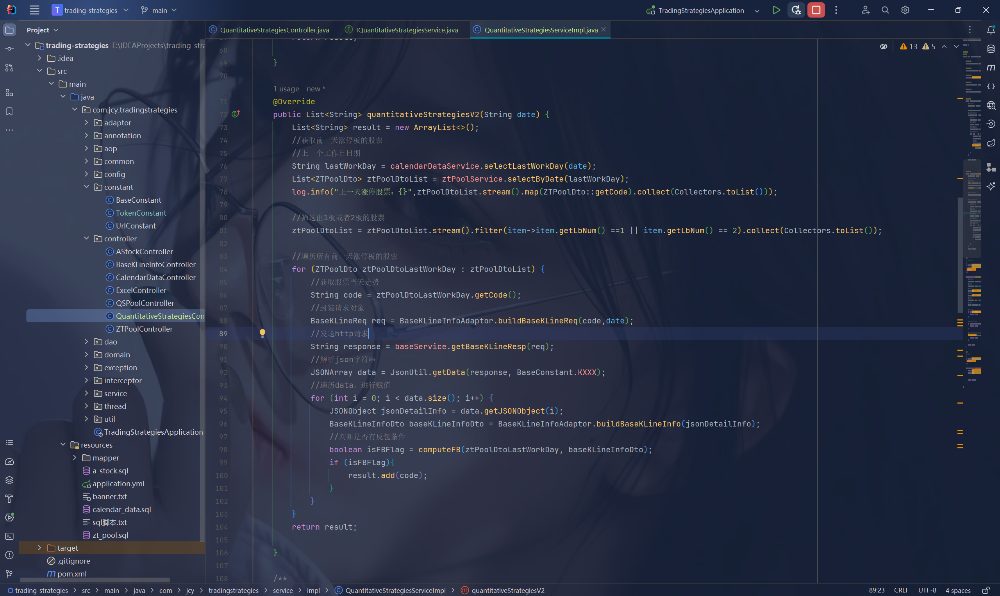

# trading-strategies

相关技术栈：jdk8，springboot，mybatis-plus，hutool，mysql，caffeine，线程池等。项目中所有技术点纯个人搭建，技术不复杂，复杂的是背后的计算逻辑。

当前仅提供了获取某日涨停板，某日强势股，二连板，连板等功能。

其他具体量化策略相关接口以及交易策略目前暂时不提供。

由于token是付费获取，所以当前工程中没有提供token，如果想使用该工程，需要使用UrlConstant中没有token的url路径替换BaseServiceImpl里面的url路径。

新增接口文档支持~：http://127.0.0.1:8080/doc.html#/home 

如有喜欢做交易志同道合的朋友可以加V：Jiangcy233

我的口号是：编程创造一切，拒绝人工复盘，直接代码导出~

### 其他复盘以及交易策略后续会根据需求慢慢展示，尽情期待~~~

### --致交易者
做交易的人一旦成功了，
一生都不用为钱发愁了。
十年痛苦无人问，
一招悟道世人问。
只有自己知道，
曾经的自己承受过什么，
你所付出的终将拿回来。

### --致码农
编程和金融都是一张王牌，
如果两者结合到一起就是一副王炸。
只要有想法，
没有什么是代码实现不了的。
只要有行动，
一切都将会取得成功。